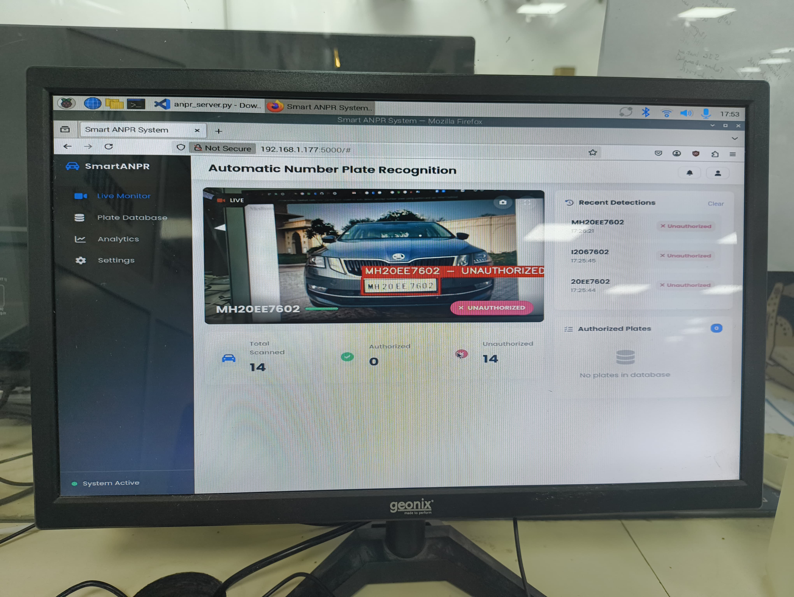

# Automatic Number Plate Recognition (ANPR) System

A complete ANPR system that runs on a Raspberry Pi with a webcam. The system detects license plates in real-time, matches them against an authorized database, and displays results through an attractive web interface.

## Features

- Real-time license plate detection and recognition
- Dictionary-based authorization system with vehicle descriptions
- Modern, responsive web interface
- Manual plate entry option for testing
- Detection history and statistics
- Toast notifications for plate detections

## Components

### Hardware
- Raspberry Pi (3 or 4 recommended)
- USB Webcam
- Internet connection

### Software
- Python 3.7+ with OpenCV and Tesseract OCR
- Flask web server
- NEXTJS frontend

## Usage

1. Access the web interface at `http://[raspberry-pi-ip]:5000`
2. Position your webcam to capture incoming vehicles
3. The system will automatically detect license plates and check if they're authorized
4. Use the manual entry feature to test specific license plates

## Customization

- Edit the `AUTHORIZED_PLATES_DICT` in `anpr_server.py` to modify the authorized plates
- Adjust detection parameters in the Python code for better accuracy
- Modify the UI by editing the HTML, CSS, and JavaScript files

## Images

